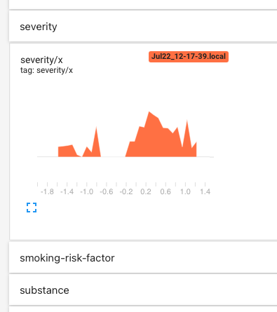

# KGCN Diagnosis Example

This example is entirely fabricated as a demonstration for how to construct a GNN machine learning pipeline with TypeDB and KGLIB. Since the data for this example is generated synthetically, it also functions as a tweakable test platform.

## Synthetic Data

Studying the schema for this example (using TypeDB Studio), we have people who present symptoms, with some severity. Separately, we may know that certain symptoms can be caused by a disease. We also know information that contributes to risk-factors for certain diseases. These risk factors are determined by rules defined in the schema. Lastly, people can be diagnosed with a disease.

Visualise the schema in Studio with this query:
```
match $x sub thing;
not{ $x type thing;};
not{ $x type entity;};
not{ $x type relation;};
not{ $x type attribute;};
```


## Running the Example

Once you have [installed KGLIB via pip](../../#getting-started---running-the-machine-learning-pipeline) you can run the example as follows:

1. Make sure a TypeDB server is running, and it's compatible 

2. Clone the repo and from the project root, run the example: `python -m kglib.examples.diagnosis.diagnosis "/path/to/my/typedb/install/directory"`

   The database, schema and seed data will be set up and data will be generated synthetically.

3. You should observe console output to indicate that the pipeline is running and that the model is learning.

## Diagnosis Pipeline

The process conducted by the example is as follows:

1. Generate a synthetic graph
   - This requires specifying queries that will retrieve Concepts from TypeDB
   - The answers from these queries are merged together into an in-memory NetworkX graph
2. Find the Types and Roles present in the schema. If any are not needed for learning then they should be excluded from the exhaustive list for better accuracy.
3. Run the pipeline
4. Write the predictions made to TypeDB

## Binary Relation Prediction a.k.a. Link Prediction

This example can predict binary edges only. Additional effort is required to predict ternary or N-ary relations.

## Tensorboard



The example demonstrates how to plot histograms for the features of each node type in the data such that you can easily debug whether they are properly normalised. It also shows the trend of scalars during learning. Try it with `tensorboard --logdir runs`.

## How does Link Prediction work?

The methodology used for Relation prediction is as follows:

In this example, we aim to predict `diagnosis` Relations. We have the correct `diagnosis` relations, and we use 

We then teach the KGCN to distinguish between the positive and negative targets.

## Querying for the Train/Test Datasets

We do this by creating *examples*, where each example is a subgraph extracted from a TypeDB knowledge Graph. These subgraphs contain positive and negative instances of the relation to be predicted.

A single subgraph is created by making multiple queries to TypeDB. In this example, each subgraph centres around a `person` who is uniquely identifiable. This is important, since we want the results for these queries to return information about the vacinity of an individual. That is, we want information about a subgraph rather than the whole graph. For this example you can find the queries made in [diagnosis.py](diagnosis.py).

A single subgraph is extracted from TypeDB by making these queries and combining the results into a graph. For your own domain you should find queries that will retrieve the most relevant information for the Relations you are trying to predict.

We can visualise such a subgraph by running these queries one after the other in TypeDB Studio:

[//]: # (![queried subgraph]&#40;.images/queried_subgraph.png&#41;)

You can get the relevant version of TypeDB Studio from the Assets of the [latest Studio release]().

Using Studio like this is a great way to understand the subgraphs that are actually being delivered to the KGCN -- a great understanding and debugging tool.

## Modifying the Example

As much as possible the example here has been made as a template for link prediction or any other PyTorch Geometric task. To change and experiment with various other neural network configurations should be easy enough by modifying the layers in `LinkPredictionModel`. If you need a different problem formulation then take a look at the [examples in PyG](https://github.com/pyg-team/pytorch_geometric/tree/master/examples/hetero) for inspiration.

If you need to encode full strings as features, take a look at this [sentence transformers](https://pypi.org/project/sentence-transformers/) project, which is used in some PyG examples.