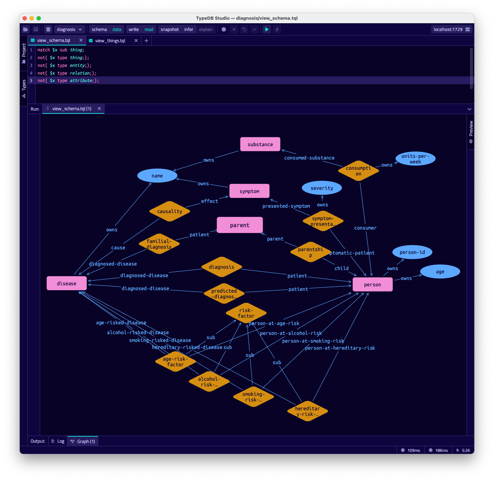

# Link Prediction with TypeDB and PyTorch Geometric

This example demonstrates how to build a Graph Neural Network (GNN) machine learning pipeline using TypeDB, KGLIB and PyTorch Geometric for [link prediction](https://en.wikipedia.org/wiki/Link_prediction) over TypeDB data.

## Run the Example

Once you have [installed KGLIB](/README.md#install) you can run the example as follows:

1. Make sure a TypeDB server (version 2.10+) is running locally 

2. Clone KGLIB (shallow clone: `git clone --depth 1`) and from the project root, run the example: `python -m kglib.examples.diagnosis.diagnosis "/path/to/my/typedb/install/directory"`

3. The database, schema and seed data will be set up and data will be generated synthetically. You should see console output to indicate that the pipeline is running and that the model is learning. Finally, the predicted relations are shown, and they are written back into TypeDB as the type `predicted-diagnosis`.

## Key steps in the Example

The process conducted by the example is as follows:

1. Generate a synthetic graph
   - This requires specifying queries that will retrieve Concepts from TypeDB
   - The answers from these queries are merged together into an in-memory NetworkX graph
2. Find the Types and Roles present in the schema. If any are not needed for learning then they should be excluded from the exhaustive list for better accuracy.
3. Configure the encoders for the different types present
4. Run the defined pipeline, including splitting and transformations of the graph(s) and defining and feeding a neural network. In this example we use `Heterogeneous Graph Transformer (HGTConv)` which is effective for our synthetic data.  
5. Write the predictions made to TypeDB

### Modifying the Example

As much as possible the example here has been made as a template for link prediction or any other PyTorch Geometric task. To change and experiment with various other neural network configurations should be easy enough by modifying the layers in `LinkPredictionModel`. If you need a different problem formulation then take a look at the [examples in PyG](https://github.com/pyg-team/pytorch_geometric/tree/master/examples/hetero) for inspiration.

You'll need to change steps 1, 2 and 3 above to suit your own schema and data. When specifying encoders for the different types present, if you need to encode full strings as features, take a look at this [sentence transformers](https://pypi.org/project/sentence-transformers/) project, which is used in some PyG examples.

## Binary Relation Prediction a.k.a. Link Prediction

This example can predict binary relations only; additional effort is required to predict ternary or N-ary relations.

### How does Link Prediction work?

The methodology used here for relation prediction is as follows:

In this example, we aim to predict `diagnosis` relations. Each person in the dataset should either have a diagnosis of `"Multiple Scleerosis"` or of `"Diabetes Type II"`. We have the correct `diagnosis` relations, and we use `RandomLinkSplit` to split these examples into train, validation and test sets, and to create negative samples.

We collapse these TypeDB `diagnosis` relations from a relation node into a binary edge, since we know this is a binary relation type with only ever two roleplayers. We use this simplification as it makes it trivial to predict all possible (and valid) binary relations between `disease` and `person` types, simply using the matrix dot product of the learned representation of each `disease` and each `person`. You can see this in `decode_all`. It's likely this approach can be extended to handle ternary or N-ary relations, but we don't support functionality for it here yet.

## Tensorboard

The example demonstrates how to plot histograms for the features of each node type in the data such that you can easily debug whether they are properly normalised. It also shows the trend of scalars during learning. Try it with `tensorboard --logdir runs`.

## Synthetic Data

This example uses a synthetically generated dataset, which utilises a [Probability Mass Function (PMF)](https://en.wikipedia.org/wiki/Probability_mass_function) to pick the likelihood of each permutation of features being present for a given example.

Studying the schema for this example (using TypeDB Studio), we have people who present symptoms, with some severity. Separately, we may know that certain symptoms can be caused by a disease. We also know information that contributes to risk-factors for certain diseases. These risk factors are determined by rules defined in the schema. Lastly, people can be diagnosed with a disease.

Visualise the schema in Studio with this query:
```
match $x sub thing;
not{ $x type thing;};
not{ $x type entity;};
not{ $x type relation;};
not{ $x type attribute;};
```



Visualise the data with this query:
```
match $x isa thing;
```


