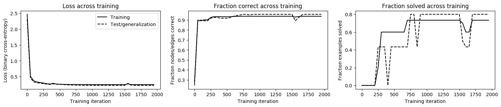
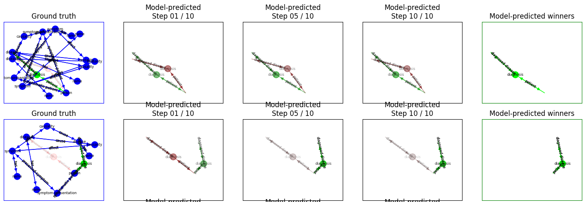

# Knowledge Graph Convolutional Networks

This project introduces a novel model: the *Knowledge Graph Convolutional Network* (KGCN). This project is in its second major iteration since its inception. 

**Summary**

This KGCN framework is designed to provide a versatile means of performing learning tasks over a Grakn knowledge graph, including:

- Predicting the existence of new [Relations](https://dev.grakn.ai/docs/schema/concepts#relation) that between existing [Concepts](https://dev.grakn.ai/docs/concept-api/overview). These relations can be binary, **ternary** (3-way) or [**N-ary**](), since Relations in Grakn are graph [Hyperedges](https://en.wikipedia.org/wiki/Glossary_of_graph_theory_terms#hyperedge). This functionality is included in the [latest release](https://github.com/graknlabs/kglib/releases/latest).
- Predicting the values of [Attributes](https://dev.grakn.ai/docs/schema/concepts#attribute) attached to other Concepts
- Predicting a subgraph of Entities, Relations and Attributes to complete a known graph
- Predicting erroneous data in a graph
- Predicting many connections within a graph such that the graph as a whole is optimised to satisfy some criteria
- Creating embeddings for Grakn Concepts

Understand the full capabilities of KGCNs by examining the methodology outlined below

## Quickstart
**Requirements**

- Python >= 3.6

- kglib installed via pip: `pip install grakn-kglib`. 

- The [latest release of Grakn Core](https://github.com/graknlabs/grakn/releases/latest) or [Grakn KGMS](https://dev.grakn.ai/docs/cloud-deployment/kgms) running.

### Usage

See the [full example](https://github.com/graknlabs/kglib/tree/master/kglib/kgcn/examples/diagnosis/diagnosis.py) of how to use a KGCN for Relation prediction. You can use this as a template to create a KGCN for your own Grakn database. If you need to customise the learning or model used, you'll need to make changes to the [pipeline](https://github.com/graknlabs/kglib/tree/master/kglib/kgcn/pipeline/pipeline.py) used.

Once you have installed kglib via pip (as above) you can run the example as follows:

1. Start a Grakn server

2. Load [the schema](kglib/utils/grakn/synthetic/examples/diagnosis/schema.gql) for the example into Grakn. The template for the command is `./grakn console -k diagnosis -f path/to/schema.gql`

3. Run the example: `python -m kglib.kgcn.examples.diagnosis.diagnosis`

4. You should observe console output to indicate that the pipeline is running and that the model is learning. Afterwards two plots should be created to visualise the training process and examples of the predictions made.

## Output

### Console

During training, the console will output metrics for the performance on the training and test sets.

You should see output such as this for the diagnosis example:
```
# (iteration number), T (elapsed seconds), Ltr (training loss), Lge (test/generalization loss), Ctr (training fraction nodes/edges labeled correctly), Str (training fraction examples solved correctly), Cge (test/generalization fraction nodes/edges labeled correctly), Sge (test/generalization fraction examples solved correctly)
# 00000, T 8.7, Ltr 2.4677, Lge 2.3044, Ctr 0.2749, Str 0.0000, Cge 0.2444, Sge 0.0000
# 00050, T 11.3, Ltr 0.5098, Lge 0.4571, Ctr 0.8924, Str 0.0000, Cge 0.8983, Sge 0.0000
# 00100, T 14.0, Ltr 0.3694, Lge 0.3340, Ctr 0.8924, Str 0.0000, Cge 0.8983, Sge 0.0000
# 00150, T 16.6, Ltr 0.3309, Lge 0.3041, Ctr 0.9010, Str 0.0000, Cge 0.8919, Sge 0.0000
# 00200, T 19.2, Ltr 0.3125, Lge 0.2940, Ctr 0.9010, Str 0.0000, Cge 0.8919, Sge 0.0000
# 00250, T 21.8, Ltr 0.2975, Lge 0.2790, Ctr 0.9254, Str 0.2000, Cge 0.9178, Sge 0.4333
# 00300, T 24.4, Ltr 0.2761, Lge 0.2641, Ctr 0.9332, Str 0.6000, Cge 0.9243, Sge 0.4333
# 00350, T 27.0, Ltr 0.2653, Lge 0.2534, Ctr 0.9340, Str 0.6000, Cge 0.9243, Sge 0.4333
# 00400, T 29.7, Ltr 0.2866, Lge 0.2709, Ctr 0.9332, Str 0.6000, Cge 0.9178, Sge 0.0000
# 00450, T 32.3, Ltr 0.2641, Lge 0.2609, Ctr 0.9324, Str 0.6000, Cge 0.9178, Sge 0.4333
# 00500, T 34.9, Ltr 0.2601, Lge 0.2544, Ctr 0.9324, Str 0.6000, Cge 0.9178, Sge 0.4333
# 00550, T 37.5, Ltr 0.2571, Lge 0.2501, Ctr 0.9332, Str 0.6000, Cge 0.9243, Sge 0.4333
# 00600, T 40.1, Ltr 0.2530, Lge 0.2404, Ctr 0.9348, Str 0.6000, Cge 0.9373, Sge 0.4333
# 00650, T 42.7, Ltr 0.2508, Lge 0.2363, Ctr 0.9356, Str 0.6000, Cge 0.9438, Sge 0.4333
# 00700, T 45.3, Ltr 0.2500, Lge 0.2340, Ctr 0.9372, Str 0.7333, Cge 0.9503, Sge 0.4333
# 00750, T 48.0, Ltr 0.2493, Lge 0.2307, Ctr 0.9372, Str 0.7333, Cge 0.9567, Sge 0.8000
# 00800, T 50.7, Ltr 0.2488, Lge 0.2284, Ctr 0.9372, Str 0.7333, Cge 0.9567, Sge 0.8000
```

Take note of the key:

- \# - iteration number
- T - elapsed seconds
- Ltr - training loss
- Lge - test/generalization loss
- Ctr - training fraction nodes/edges labeled correctly
- Str - training fraction examples solved correctly
- Cge - test/generalization fraction nodes/edges labeled correctly
- Sge - test/generalization fraction examples solved correctly

The element we are most interested in is `Sge`, the proportion of subgraphs where all elements of the subgraph were classified correctly. This therefore represents an entirely correctly predicted example.

### Diagrams

#### Training Metrics
Upon running the example you will also get plots from matplotlib saved to your working directory.

You will see plots of metrics for the training process (training iteration on the x-axis) for the training set (solid line), and test set (dotted line). From left to right:

- The absolute loss across all of the elements in the dataset
- The fraction of all graph elements predicted correctly across the dataset
- The fraction of completely solved examples (subgraphs extracted from Grakn)



#### Visualise Predictions

We also receive a plot of some of the predictions made on the test set. 

**Blue box:** Ground Truth 

- Preexisting (known) graph elements are shown in blue

- Relations and role edges that **should be predicted to exist** are shown in green

- Candidate relations and role edges that **should not be predicted to exist** are shown faintly in red

**Black boxes**: Model Predictions at certain message-passing steps

This uses the same colour scheme as above, but opacity indicates a probability given by the model.

The learner predicts three classes for each graph element. These are:

```
[
Element already existed in the graph (we wish to ignore these elements),
Element does not exist in the graph,
Element does exist in the graph
]
```

In this way we perform relation prediction by proposing negative candidate relations (Grakn's rules help us with this). Then we train the learner to classify these negative candidates as **does not exist** and the correct relations as **does exist**.

These boxes shows the score assigned to the class **does exist**.

Therefore, for good predictions we want to see no blue elements, and for the red elements to fade out as more messages are passed, the green elements becoming more certain.




This visualisation has some flaws, and will be improved in the future.

## Methodology

The methodology that this implementation uses for Relation prediction is as follows:

In the case of the diagnosis example, we aim to predict `diagnosis` Relations. We have the correct `diagnosis` relations, and we write a Grakn rule to insert `candidate-diagnosis` relations as negative examples. They are added wherever a real `diagnosis` Relation could logically exist, but does not.

We then teach the KGCN to distinguish between the positive and negative examples.

### Examples == Subgraphs

We do this by creating *examples*, where each example is a subgraph extracted from a Grakn knowledge Graph. These subgraphs contain positive and negative instances of the relation to be predicted.

A single subgraph is created by making multiple queries to Grakn. In the diagnosis example, each subgraph centres around a `person` who is uniquely identifiable. This is important, since we want the results for these queries to return imformation about the vacinity of an individual. That is, we want information about a subgraph rather than the whole graph. 

In this example the queries used are:
```
match
$p isa person, has example-id {example_id};
$s isa symptom, has name $sn;
$d isa disease, has name $dn;
$sp(presented-symptom: $s, symptomatic-patient: $p) isa symptom-presentation;
$c(cause: $d, effect: $s) isa causality;
$diag(patient: $p, diagnosed-disease: $d) isa diagnosis;
get;
```
```
match
$p isa person, has example-id {example_id};
$s isa symptom, has name $sn;
$d isa disease, has name $dn;
$sp(presented-symptom: $s, symptomatic-patient: $p) isa symptom-presentation;
$c(cause: $d, effect: $s) isa causality;
$diag(candidate-patient: $p, candidate-diagnosed-disease: $d) isa candidate-diagnosis; 
get;
```
A single subgraph is extracted from Grakn by making these queries and combining the results into a graph. For your own domain you should find queries that will retrieve the most relevant information for the Relations you are trying to predict.

We can visualise such a subgraph by running these two queries in Grakn Workbase:


You can get the relevant version of Workbase from the Assets of the [latest release](https://github.com/graknlabs/workbase/releases/latest).

### Learning

A KGCN is a learned message-passing graph algorithm. Neural network components are learned, and are used to transform signals that are passed around the graph. This approach is convolutional due to the fact that the same transformation is applied to all edges and another is applied to all nodes. It may help your understanding to analogise this to convolution over images, where the same transformation is applied over all pixel neighbourhoods.

This approach leverages DeepMind's [Graph Nets](https://github.com/deepmind/graph_nets) framework, detailed in [their paper](https://arxiv.org/pdf/1806.01261.pdf). This work is a generalisation of graph learning approaches, which offers plenty of ways to structure learning tailored to various knowledge graph problems.

## Components

Here we identify the core components used to build a working KGCN.

### Application

e.g. [diagnosis example](https://github.com/graknlabs/kglib/tree/master/kglib/kgcn/examples/diagnosis/diagnosis.py)

The process conducted by the example is as follows:

1. Generate synthetic graphs, each graph is used as an *example*
   - This requires specifying queries that will retrieve Concepts from Grakn
   - The answers from these queries are used to create subgraphs, stored in-memory as networkx graphs
2. Find the Types and Roles present in the schema. If any are not needed for learning then they should be excluded from the exhaustive list for better accuracy.
3. Run the pipeline
4. Write the predictions made to Grakn

### Pipeline

Can be customised from [pipeline](https://github.com/graknlabs/kglib/tree/master/kglib/kgcn/pipeline/pipeline.py). A pipeline performs the following:

1. Take in graphs and the training/generalistaion split
2. Encode graph values (including type information) into numerics
3. Perform prerequisite graph formatting and manipulation
4. Build the neural network model, providing embedding models for Attribute Types
   - Currently only categorical encoding is supported. Continuous values for attributes will be supported soon
5. Run the learning process
6. Create visualisations
7. Record the predictions made, and return them in graphs

### KGCNLearner

- Performs the training loop
- Manages the loss function and optimiser
- Manages the TensorFlow session
- Prints results for the training and generalistaion datasets during training 

### KGCN

Defines the computation graph for a KGCN, including the initial embedding of values and the edge/node/graph feature update strategy during message-passing. This is the core that depends upon [Graph Nets](https://github.com/deepmind/graph_nets).