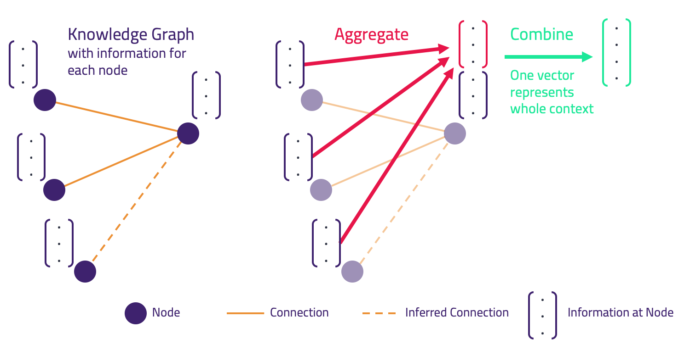
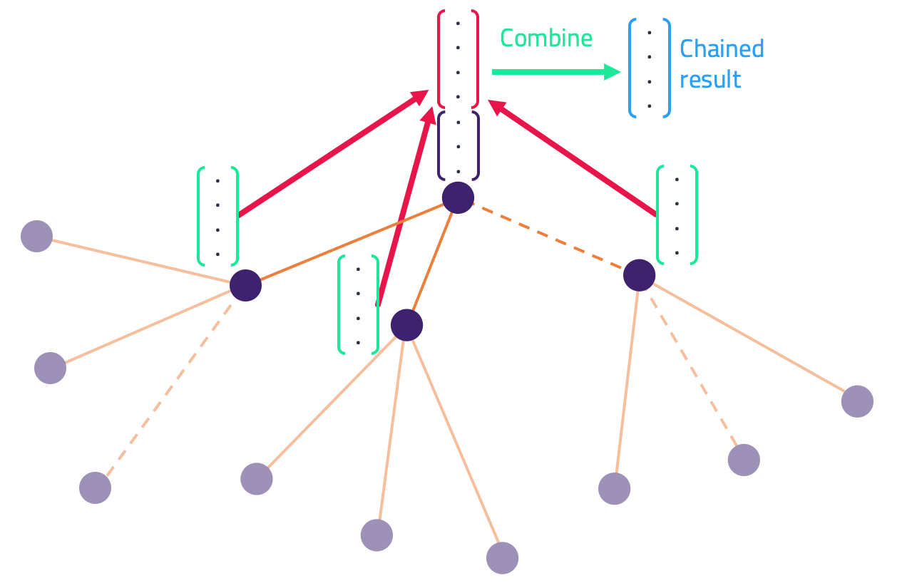
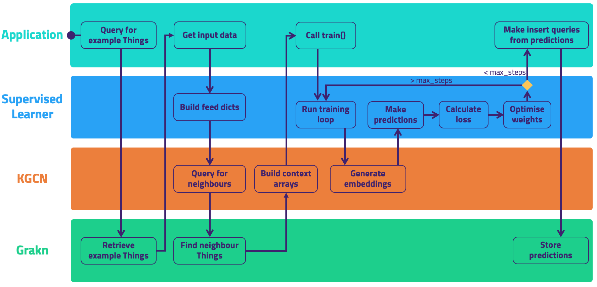

# Knowledge Graph Convolutional Networks (KGCNs)

This project introduces a novel model: the *Knowledge Graph Convolutional Network* (KGCN). The [principal idea of this work](https://blog.grakn.ai/knowledge-graph-convolutional-networks-machine-learning-over-reasoned-knowledge-9eb5ce5e0f68) is to forge a bridge between knowledge graphs, automated logical reasoning, and machine learning, using [Grakn](https://github.com/graknlabs/grakn) as the knowledge graph.

**Summary**

A KGCN can be used to create vector representations, *embeddings*, of any labelled set of Grakn [Things](https://dev.grakn.ai/docs/concept-api/overview) via supervised learning.

1. A KGCN can be trained directly for the classification or regression of Things stored in Grakn. 
2. Future work will include building embeddings via unsupervised learning.

## What is it used for?

Often, data doesn't fit well into a tabular format. There are many benefits to storing complex and interrelated data in a knowledge graph, not least that the context of each datapoint can be stored in full.

However, many existing machine learning techniques rely upon the existence of an *input vector for each example*. Creating such a vector to represent a node in a knowledge graph is non-trivial.

In order to make use of the wealth of existing ideas, tools and pipelines in machine learning, we need a method of building these vectors. In this way we can leverage contextual information from a knowledge graph for machine learning.

This is what a KGCN can achieve. Given an example node in a knowledge graph, it can examine the nodes in the vicinity of that example, its *context*. Based on this context it can determine a vector representation, an *embedding*, for that example.

**There are two broad learning tasks a KGCN is suitable for:**

**1. Supervised learning from a knowledge graph for prediction e.g. multi-class classification (implemented), regression, link prediction**
**2. Unsupervised creation of Knowledge Graph Embeddings, e.g. for clustering and node comparison tasks**


In order to build a *useful* representation, a KGCN needs to perform some learning. To do that it needs a function to optimise. Revisiting the broad tasks we can perform, we have different cases to configure the learning:

1. In the supervised case, we can optimise for the exact task we want to perform. In this case embeddings are interim tensors in a learning pipeline
2. To build unsupervised embeddings as the output, we optimise to minimise some similarity metrics across the graph

## Quickstart

**Requirements:**

- Python 3.6.3 <= version < 3.7 ([tensorflow doesn't yet support Python 3.7](https://github.com/tensorflow/tensorflow/issues/17022))

- Ensure that `pip` uses the Python version listed above. Find out using 'pip --version'. By default `pip` may use Python 2, in which case you may need either `pip3`, or to create an isolated environment using `pipenv`/`virtualenv`, or change your global Python with `pyenv`.

- kglib installed from pip: `pip install grakn-kglib`. 

### Usage

The following is a template of what must be defined in order to instantiate a KGCN, optimised for a downstream learning task of multi-class classification:

```python
import kglib.kgcn.core.model as model
import kglib.kgcn.learn.classify as classify
import tensorflow as tf
import grakn

URI = "localhost:48555"

client = grakn.Grakn(uri=URI)
session = client.session(keyspace=training_keyspace)
transaction = session.transaction(grakn.TxType.WRITE)

kgcn = model.KGCN(neighbour_sample_sizes,
                  features_size,
                  example_things_features_size,
                  aggregated_size,
                  embedding_size,
                  transaction,
                  batch_size)

optimizer = tf.train.GradientDescentOptimizer(learning_rate=learning_rate)

classifier = classify.SupervisedKGCNClassifier(kgcn,
                                               optimizer, 
                                               num_classes, 
                                               log_dir,
                                               max_training_steps=max_training_steps)

training_feed_dict = classifier.get_feed_dict(session, 
                                              training_things, 
                                              labels=training_labels)

classifier.train(training_feed_dict)

transaction.close()
session.close()
```

There is also a [full example](https://github.com/graknlabs/kglib/tree/master/examples/kgcn/animal_trade) which outlines retrieving a set of example Things with labels and working with separate keyspaces for training and testing.

## Methodology

The ideology behind this project is described [here](https://blog.grakn.ai/knowledge-graph-convolutional-networks-machine-learning-over-reasoned-knowledge-9eb5ce5e0f68), and a [video of the presentation](https://youtu.be/Jx_Twc75ka0?t=368). The principles of the implementation are based on [GraphSAGE](http://snap.stanford.edu/graphsage/), from the Stanford SNAP group, heavily adapted to work over a knowledge graph. Instead of working on a typical property graph, a KGCN learns from contextual data stored in a *typed hypergraph*, **Grakn**. Additionally, it learns from facts deduced by Grakn's *automated logical reasoner*. From this point onwards some understanding of [Grakn's docs](http://dev.grakn.ai) is assumed.

Now we introduce the key components and how they interact.

### KGCN

A KGCN is responsible for deriving embeddings for a set of Things (and thereby directly learn to classify them). We start by querying Grakn to find a set of labelled examples. Following that, we gather data about the context of each example Thing. We do this by considering their neighbours, and their neighbours' neighbours, recursively, up to K hops away.

We retrieve the data concerning this neighbourhood from Grakn (diagram above). This information includes the *type hierarchy*, *roles*, and *attribute value* of each neighbouring Thing encountered, and any inferred neighbours (represented above by dotted lines). This data is compiled into arrays to be ingested by a neural network.

Via operations Aggregate and Combine, a single vector representation is built for a Thing. This process can be chained recursively over *K* hops of neighbouring Things. This builds a representation for a Thing of interest that contains information extracted from a wide context.



In supervised learning these embeddings are directly optimised to perform the task at hand. For multi-class classification this is achieved by passing the embeddings to a single subsequent dense layer and determining loss via softmax cross entropy (against the example Things' labels); then, optimising to minimise that loss.

A KGCN object brings together a number of sub-components, a Context Builder, Neighbour Finder, Encoder, and an Embedder.

#### Context Builder

In order to feed a TensorFlow neural network, we need regular array structures of input data. The Context Builder builds these *context arrays*. For each example Thing, it talks to a **Neighbour Finder**, which queries Grakn for (a sub-sample of) the neighbours of that example Thing. For each neighbouring Thing, the Neighbour Finder retrieves its:

- Id
- Type
- Meta-Type (either Entity or Relation or Attribute)
- Data-type (if it's an attribute)
- Value (if it's an attribute)
- The Role that connects the example to that neighbour
- The direction of that Role

It passes these to the Context Builder to be added to the context arrays.

Using the unique ids of those 1-hop neighbours, KGCN queries Grakn for (a sub-sample of) their 2-hop neighbours and, again, store the information found for them. This process is recursive until K-hops has been reached.

These context arrays are composed by KGCN into feed dicts (TensorFlow terminology), which can be fed to the network. This could (probably should) be replaced by TensorFlow Datasets as input to the network.

#### Encoder

Having built context arrays, these need to be mapped to numerical vector representations. This is performed by an Encoder that operates inside the TensorFlow computation graph, acting immediately after the data is input to the TensorFlow placeholders.

All of the data contained in the context arrays is encoded in this step.

- Role Types are multi-hot encoded according to their hierarchy
- Role directions are not affected
- Neighbour Types are multi-hot encoded according to their hierarchy
- Neighbour Data Types are one-hot encoded
- Longs are converted to floats
- Doubles are not affected
- Booleans are encoded to True = 1, False = 0, Not present = -1
- Dates are given in unixtime and converted to floats, then normalised
- Strings are encoded to 128 dimensional floats using a [pre-trained network](https://tfhub.dev/google/nnlm-en-dim128-with-normalization/1) from TensorFlow Hub

#### Embedder

To create embeddings, we build a network in TensorFlow that successively aggregates and combines features from the K hops until a 'summary' representation remains - an embedding (diagram below). 

To create the pipeline, the Embedder chains Aggregate and Combine operations for the K-hops of neighbours considered. e.g. for the 2-hop case this means Aggregate-Combine-Aggregate-Combine.


The diagram above shows how this chaining works in the case of supervised classification.

Embedder is responsible for chaining the sub-components Aggregator and Combiner, explained below.

##### Aggregator

An *Aggregator* (pictured below) takes in a vector representation of a sub-sample of a Thing's neighbours. It produces one vector that is representative of all of those inputs. It must do this in a way that is order agnostic, since the neighbours are unordered. To achieve this we use one densely connected layer, and *maxpool* the outputs (maxpool is order-agnostic).

##### Combiner

Once we have Aggregated the neighbours of a Thing into a single vector representation, we need to combine this with the vector representation of that thing itself. A *Combiner* achieves this by concatenating the two vectors, and reduces the dimensionality using a single densely connected layer.


### Supervised KGCN Classifier

A Supervised KGCN Classifier is responsible for orchestrating actual learning. It takes in a KGCN instance and as for any learner making use of a KGCN, it provides:

- Methods for **train/evaluation/prediction**
- **A pipeline** from embedding tensors to predictions
- **A loss function** that takes in predictions and labels
- An optimiser
- The backpropagation training loop

It must be the class that provides these behaviours, since a KGCN is not coupled to any particular learning task. This class therefore provides all of the specialisations required for a supervised learning framework.

Below is a slightly simplified UML activity diagram of the program flow.

