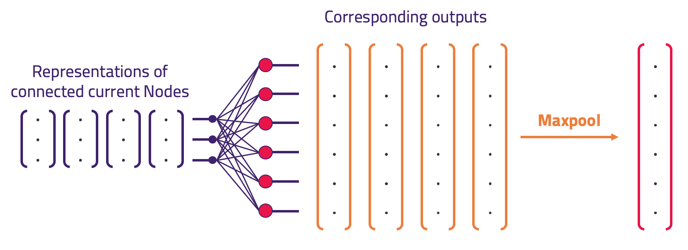
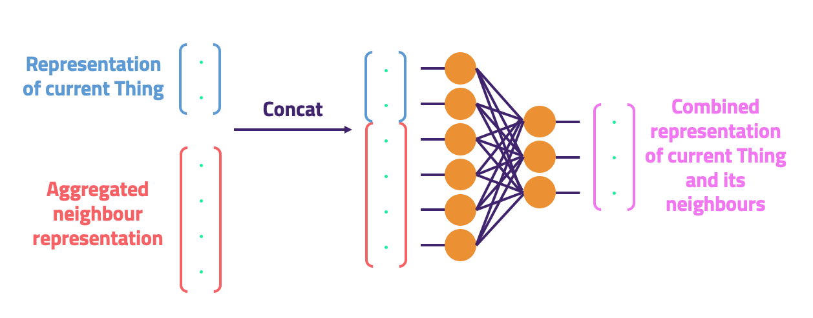

# Knowledge Graph Convolutional Networks (KGCNs)

This project introduces a novel model: the *Knowledge Graph Convolutional Network* (KGCN). The principal idea of this work is to forge a bridge between knowledge graphs and machine learning, using [Grakn](https://github.com/graknlabs/grakn) as the knowledge graph.

A KGCN can be used to create vector representations, *embeddings*, of any labelled set of Grakn [Things](https://dev.grakn.ai/docs/concept-api/overview) via supervised learning.    

As a result, a KGCN can be trained directly for the classification or regression of Things stored in Grakn. Future work will include building embeddings via unsupervised learning.

## Use-Case

Often, data doesn't fit well into a tabular format. Many existing machine learning techniques rely upon an input *vector for each sample*. This makes using many conventional machine learning techniques unfeasible when your input data doesn't have this structure. 

Instead, your data can be stored in a knowledge graph. Now, however, to use existing ideas, tools and pipelines, we need a method of building a *vector for each sample*, so that we can leverage the knowledge graph for the task we want to perform.

This is what a KGCN can achieve. It can examine a knowledge graph to assess the data in the vicinity of a sample. Based on this vicinity it can determine a representation (*embedding*) for that sample.

Subsequently, the embeddings can be fed into some learning pipeline which performs the task we're actually interested in. We refer to this task as *downstream learning*, which could be classification, regression, link prediction etc., or unsupervised learning.


In order to build a *useful* representation, a KGCN needs to perform some learning. To do that we need a function to optimise. In the supervised case, we can use this to our advantage and optimise the exact task we want to perform.

This may be counter to intuition, in this case embeddings are an intermediate step in a single learning pipeline. in this way the whole pipeline performs the end task (classification/regression/otherwise), and the KGCN is directly optimised to that task.


## Quickstart

**Requirements:**

- Python 3.6.3 <= version < 3.7 ([tensorflow doesn't yet support Python 3.7](https://github.com/tensorflow/tensorflow/issues/17022))

- Ensure that `pip` uses the Python version listed above. Find out using 'pip --version'. By default `pip` may use Python 2, in which case you may need either `pip3`, or to create an isolated environment using `pipenv`/`virtualenv`, or change your global Python with `pyenv`.

- kglib installed from pip: `pip install grakn-kglib`. 

### Usage

The following is a template of what must be defined in order to instantiate a KGCN, optimised for a downstream learning task of multi-class classification:

```python
import kglib.kgcn.models as models
import tensorflow as tf
import grakn

URI = "localhost:48555"

client = grakn.Grakn(uri=URI)
session = client.session(keyspace=training_keyspace)
transaction = session.transaction(grakn.TxType.WRITE)

kgcn = models.model.KGCN(neighbour_sample_sizes,
                         features_length,
                         starting_things_features_length,
                         aggregated_length,
                         output_length,
                         transaction,
                         batch_size,
                         buffer_size
                         )

optimizer = tf.train.GradientDescentOptimizer(learning_rate=learning_rate)
classifier = models.downstream.SupervisedKGCNClassifier(kgcn, optimizer, num_classes, log_dir,
                                                        max_training_steps=max_training_steps)

training_feed_dict = classifier.get_feed_dict(session, training_things, labels=training_labels)

classifier.train(training_feed_dict)

transaction.close()
session.close()
```

There is also a [full example](https://github.com/graknlabs/kglib/tree/master/examples/kgcn/animal_trade) which outlines retrieving sample Things with labels and working with separate keyspaces for training and testing.

## Methodology

The ideology behind this project is described [here](https://blog.grakn.ai/knowledge-graph-convolutional-networks-machine-learning-over-reasoned-knowledge-9eb5ce5e0f68), and a [video of the presentation](https://youtu.be/Jx_Twc75ka0?t=368). The principles of the implementation are based on [GraphSAGE](http://snap.stanford.edu/graphsage/), from the Stanford SNAP group, made to work over a knowledge graph. Instead of working on a typical property graph, a KGCN learns from the context of a *typed hypergraph*, **Grakn**. Additionally, it learns from facts deduced by Grakn's *automated logical reasoner*. From this point onwards some understanding of [Grakn's docs](http://dev.grakn.ai) is assumed.

### How do KGCNs work?

#### Consider the neighbourhood

The purpose of this method is to derive embeddings for a set of Things (and thereby directly learn to classify them). We start by querying Grakn to find a set of labelled examples. Following that, we gather data about the context of each example Thing. We do this by considering their *k-hop* neighbours.

We retrieve the data concerning this neighbourhood from Grakn (diagram above). This information includes the *type hierarchy*, *roles*, and *attribute* values of each neighbouring Thing encountered, and any inferred neighbours (dotted lines, above).

#### The Input Data

In order to feed a TensorFlow neural network, we need regular array structures of input data. The Context Builder builds these *context arrays*. It talks to a Neighbour Finder, which queries Grakn for (a sub-sample of) the neighbours of the starting Things. For each Thing, the Neighbour Finder retrieves its Id, Type, Meta-Type (either Entity or Relationship or Attribute), its data-type and value (if its an attribute), and the Role that connects to that Thing, plus the direction of that Role. It passes these to the Context Builder to be added to the context arrays.

Using the unique Ids of those 1-hop neighbours, KGCN queries Grakn for (a sub-sample of) their 2-hop neighbours and, again, store the information found for them. This process is recursive until K-hops has been reached.

#### Aggregation and Combination Model

To create embeddings, we build a network in TensorFlow that successively aggregates and combines features from the K hops until a 'summary' representation remains - an embedding (diagram below). In supervised learning these embeddings are directly optimised to perform the task at hand. For multi-class classification this is achieved by passing the embeddings to a single subsequent dense layer and determining loss via softmax cross entropy with the labels retrieved; then, optimising to minimise that loss.


##### Aggregation

An *Aggregation* step (pictured below) takes in a vector representation of a subsample of a Thing's neighbours. It produces one vector that is representative of all of those inputs. It must do this in a way that is order agnostic, since the neighbours are unordered. To achieve this we use one densely connected layer, and *maxpool* the outputs (maxpool is order-agnostic).

##### Combination

Once we have Aggregated the neighbours of a Thing into a singel vector representation, we need to combine this with the vecto representation of that thing itself. We use a simple *Combination* step to achieve this, a concatenation of the two vectors, followed by reducing the dimensions using a single densely connected layer. 



##### Chaining

To create the pipeline, Aggregation and Combination operations are chained for the K-hops of neighbours considered. e.g. for the 2-hop case this means Aggregate-Combine-Aggregate-Combine.
