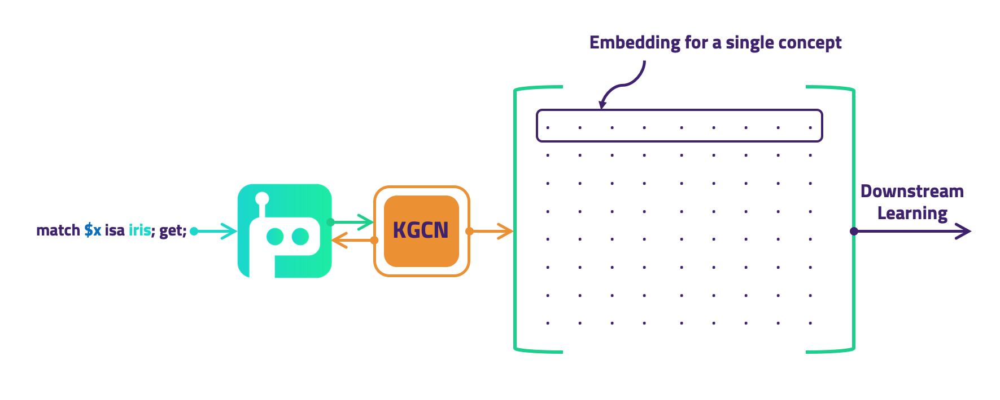
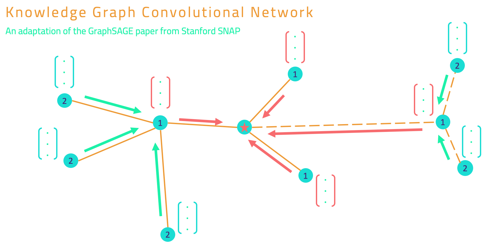

# Knowledge Graph Convolutional Networks (KGCNs)

This project introduces a novel model: the *Knowledge Graph Convolutional Network* (KGCN). The principal idea of this work is to forge a bridge between knowledge graphs and machine learning, using [Grakn](https://github.com/graknlabs/grakn) as the knowledge graph. A KGCN can be used to create vector representations, *embeddings*, of any labelled set of Grakn Concepts via supervised learning. As a result, a KGCN can be trained directly for the classification or regression of Concepts stored in Grakn. Future work will include building embeddings via unsupervised learning.

## Quickstart

**Requirements:**

- Python 3.6.3 <= version < 3.7 ([tensorflow doesn't yet support Python 3.7](https://github.com/tensorflow/tensorflow/issues/17022))

- kglib installed from pip: `pip install grakn-kglib`

### Usage

The following is a template of what must be defined in order to instantiate a KGCN, optimised for a downstream learning task of multi-class classification:

```python
import kglib.kgcn.models as models
import tensorflow as tf
import grakn

URI = "localhost:48555"

client = grakn.Grakn(uri=URI)
session = client.session(keyspace=training_keyspace)
transaction = session.transaction(grakn.TxType.WRITE)

kgcn = models.model.KGCN(neighbour_sample_sizes,
                         features_length,
                         starting_concepts_features_length,
                         aggregated_length,
                         output_length,
                         transaction,
                         batch_size,
                         buffer_size
                         )

optimizer = tf.train.GradientDescentOptimizer(learning_rate=learning_rate)
classifier = models.downstream.SupervisedKGCNClassifier(kgcn, optimizer, num_classes, log_dir,
                                                        max_training_steps=max_training_steps)

training_feed_dict = classifier.get_feed_dict(session, training_concepts, labels=training_labels)

classifier.train(training_feed_dict)

transaction.close()
session.close()
```

There is also a [full example](https://github.com/graknlabs/kglib/tree/master/examples/kgcn/animal_trade) which outlines retrieving sample concepts with labels and working with separate keyspaces for training and testing.

## Methodology

The ideology behind this project is described [here](https://blog.grakn.ai/knowledge-graph-convolutional-networks-machine-learning-over-reasoned-knowledge-9eb5ce5e0f68), and a [video of the presentation](https://youtu.be/Jx_Twc75ka0?t=368). The principles of the implementation are based on [GraphSAGE](http://snap.stanford.edu/graphsage/), from the Stanford SNAP group, made to work over a **knowledge graph**. Instead of working on a typical property graph, a KGCN learns from the context of a *typed hypergraph*, **Grakn**. Additionally, it learns from facts deduced by Grakn's *automated logical reasoner*. From this point onwards some understanding of [Grakn's docs](http://dev.grakn.ai) is assumed.

#### How do KGCNs work?

The purpose of this method is to derive embeddings for a set of Concepts (and thereby directly learn to classify them). We start by querying Grakn to find a set of labelled examples. Following that, we gather data about the neighbourhood of each example Concept. We do this by considering their *k-hop* neighbours.

We retrieve the data concerning this neighbourhood from Grakn. This information includes the *type hierarchy*, *roles*, and *attribute* values of each neighbouring Concept encountered.

To create embeddings, we build a network in TensorFlow that successively aggregates and combines features from the K hops until a 'summary' representation remains - an embedding. In our example these embeddings are directly optimised to perform multi-class classification. This is achieved by passing the embeddings to a single subsequent dense layer and determining loss via softmax cross entropy with the labels retrieved.


  

