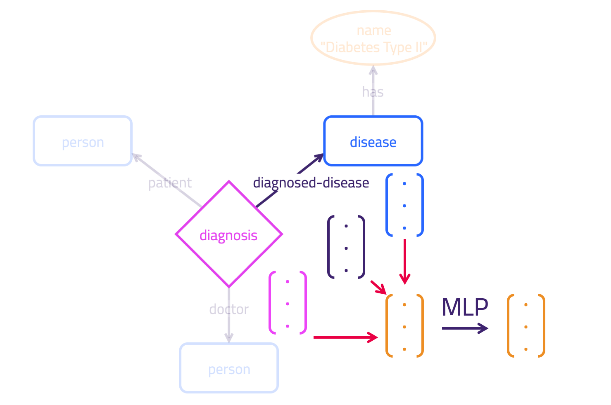

# KGCNs - Knowledge Graph Convolutional Networks

This project introduces a novel model: the *Knowledge Graph Convolutional Network* (KGCN).

### Getting Started - Running the Machine Learning Pipeline

**Requirements**

- Python >= 3.6

- KGLIB installed via pip: `pip install typedb-kglib`. 

- [TypeDB 2.1.1](https://github.com/vaticle/typedb/releases) running in the background

- the Python TypeDB client 2.1.0 ([PyPi](https://pypi.org/project/typedb-client/), [GitHub release](https://github.com/vaticle/typedb-client-python/releases))

See the [full example](https://github.com/vaticle/kglib/tree/master/kglib/kgcn/examples/diagnosis/diagnosis.py) for how to use a KGCN for [Relation](https://docs.vaticle.com/docs/schema/concepts#relation) prediction. You can use the example as a template to create a KGCN for your own TypeDB data. If you need to customise the learning or model used, you'll need to make changes to your version of the [pipeline](https://github.com/vaticle/kglib/tree/master/kglib/kgcn/pipeline/pipeline.py).

## How Do We Use Machine Learning over a Knowledge Graph?

### Relation Prediction

This KGCN framework is designed to provide a versatile means to perform learning tasks over a knowledge graph in TypeDB.

Included in the [latest release](https://github.com/vaticle/kglib/releases/latest):

- Predicting the existence of new [Relations](https://docs.vaticle.com/docs/schema/concepts#relation) between existing [Concepts](https://docs.vaticle.com/docs/concept-api/overview). These relations can be binary, **ternary** (3-way) or [**N-ary**]() (N-way), since Relations in TypeDB are graph [Hyperedges](https://en.wikipedia.org/wiki/Glossary_of_graph_theory_terms#hyperedge).

Understand the full capabilities of KGCNs by examining the methodology outlined below.

### Supervised Knowledge Graph Machine Learning

We approach learning over a Knowledge Graph just as we do classical supervised learning. We learn from a ground truth set of training examples, but in this case each example is a subgraph.

We extract these subgraphs from a TypeDB Knowledge Graph. Extracting subgraphs is performed by making Graql queries to TypeDB (multiple queries per example).


We then encode these graphs and feed them to the KGCN. As an output we receive the same graph with predicted node property values. Those predicted properties can be used to regress or classify the Concepts of our subgraphs as we see fit.

Using this method we can frame Relation prediction as a node existence classification task.

### Graphs In, Graphs Out

We can directly ingest a graph into TensorFlow and learn over that graph. This leverages DeepMind's [Graph Nets](https://github.com/deepmind/graph_nets) framework, detailed in [their paper](https://arxiv.org/abs/1806.01261) (built in TensorFlow). This work is a generalisation of graph learning techniques, which offers plenty of ways to structure learning tailored to various knowledge graph problems.

We extend this work for knowledge graphs in TypeDB, with a graph data flow as follows:


## How Does Message Passing Work?

Message passing is an iterative process. On each `superstep` messages are passed simultaneously (such that they don't influence each other) between elements of the graph. These messages are then used to update the state of graph elements.

A KGCN is a learned graph message-passing algorithm. Neural network components transform the messages that are passed around the graph. This transformation is learned in order to pass useful updates around the graph.

In our case, the algorithm looks like this:

```
for step in supersteps:
  update all edges;
  update all nodes;
```


### Edge Block

Use as input the current edge features and the features of the nodes it connects. Update the edge's features as the output of some neural network layers. Do this for all edges.



### Node Block

Use as input the node's features and the most up-to-date features of the edges that connect to it. Update the node's features as the output of some neural network layers. Do this for all nodes.


### How is this Convolutional?

This approach is described as convolutional since the same transformations are re-used across the graph. It may help your understanding to analogise this to convolution over images, where the same transformation is applied over all pixel neighbourhoods.

## How Do We Frame Relation Prediction?

In a typical use case, we have a specific Relation Type, `T`, that we want to predict. We want to predict the existence of `T` Relations based on the context that surrounds them in the graph. Our supervised learning approach requires ground truth examples.

### Creating Ground Truth Examples

Our approach is to extract subgraphs from a TypeDB knowledge graph to use as ground truth examples. 

Clearly, `T` Relations that are present are treated as fact, and given positive target labels. However, we must also consider *negative* examples of these `T` Relations.

In our ground truth example subgraphs, we apply a [closed-world assumption](https://en.wikipedia.org/wiki/Closed-world_assumption). This means that for concepts `$a1`, `$a2`, ... ,`$aN` if a Relation does not exist in `($a1, $a2, ... ,$aN)`, this indicates that there is no such Relation in `($a1, $a2, ... ,$aN)`. 

Following this closed-world assumption, we use the absence of a `T` Relation as a negative target.

Note that under an [open-world assumption](https://en.wikipedia.org/wiki/Open-world_assumption) a Relation in `($a1, $a2, ... ,$aN)` could exist but also be absent from the graph.

### How Do We Represent Negative Examples?

The KGCN needs to learn by example where it should predict new `T` Relations. Therefore, the learner needs to see all logically possible `T` Relations as candidates.

To achieve this, wherever in the subgraph a `T` Relation *could* exist, but does not, we create one (see below), giving the new Relation a negative target label. 

The learner's job is then to classify those candidates to indicate their likelihood of true existence.

Due to TypeDB's enforced schema, `T` Relations can logically only occur between certain Roleplayers. This means that the candidates to be added should be sparse - we don't see the combinatorial explosion of candidates that we would see in a homogenous subgraph.

### Adding Negative Relations Dynamically

Naturally, we don't wish to pollute our Knowledge Graph by inserting these `T` Relation candidates. Instead, we can make use of TypeDB's reasoning engine here by defining a logical [Rule](http://docs.vaticle.com/docs/schema/rules) to dynamically create these candidates (see the rule in the [example schema](../utils/typedb/synthetic/examples/diagnosis/schema.tql)). After training our learner we can simply `undefine` the rule to return to an unpolluted state.

## Architectural Components

Here we identify the core components used to build a working KGCN pipeline.

### Application

e.g. [diagnosis example](https://github.com/vaticle/kglib/tree/master/kglib/kgcn/examples/diagnosis)

1. Fetch subgraphs, each subgraph is used as an *example*
   - This requires specifying queries that will retrieve Concepts from TypeDB
   - The answers from these queries are used to create subgraphs, stored in-memory as networkx graphs
2. Find the Types and Roles present in the schema. If any are not needed for learning then they should be excluded from the exhaustive list for better accuracy.
3. Run the pipeline
4. Write the predictions made to TypeDB

### Pipeline

Can be customised from [pipeline](https://github.com/vaticle/kglib/tree/master/kglib/kgcn/pipeline/pipeline.py). A pipeline performs the following:

1. Take in graphs and the training/generalistaion split
2. Encode graph values (including type information) into numerics
3. Perform prerequisite graph formatting and manipulation
4. Build the neural network model, providing embedding models for Attribute Types
5. Run the learning process
6. Create visualisations
7. Record the predictions made, and return them in graphs

### KGCNLearner
Found in [learn.py](https://github.com/vaticle/kglib/tree/master/kglib/kgcn/learn/learn.py).
- Performs the training loop
- Manages the loss function and optimiser
- Manages the TensorFlow session
- Prints results for the training and generalistaion datasets during training 

### KGCN

Found in [core.py](https://github.com/vaticle/kglib/tree/master/kglib/kgcn/models/core.py).

Defines the computation graph for a KGCN, including the initial embedding of values and the edge/node/graph feature update strategy during message-passing. This is the core that depends upon [Graph Nets](https://github.com/deepmind/graph_nets).
